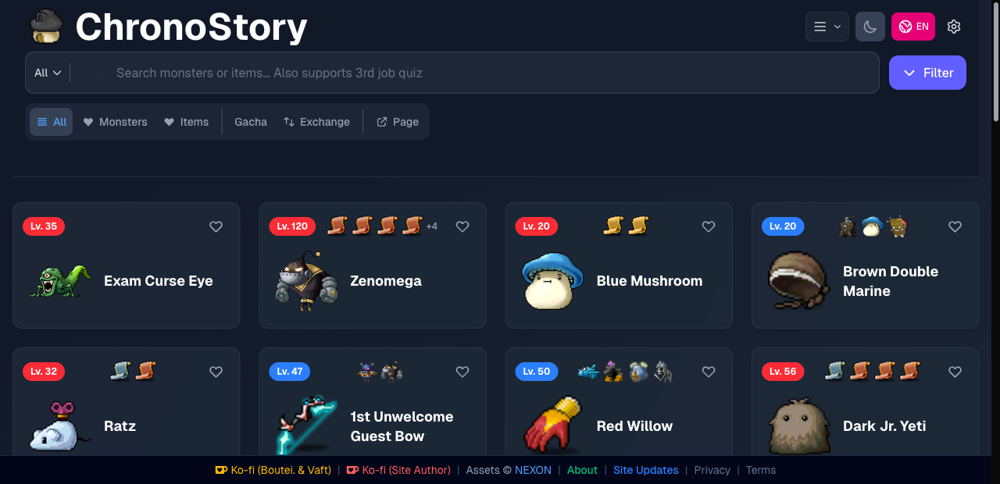

# ChronoStory Search

A full-stack monster and item drop database for MapleStory, built with Next.js 15 and deployed on Vercel.

**Live Site:** [chronostorysearch.com](https://www.chronostorysearch.com)



## Features

- **Search** - Real-time search across 2,000+ monsters and items with autocomplete suggestions
- **Advanced Filters** - Filter by item category, job class, element weakness, level range, and attack speed
- **Gacha Machine Tables** - Browse complete drop tables for gacha machines in each town
- **Scroll Exchange** - Search and compare scroll exchange rates with sorting and filtering
- **Monster Detail Pages** - SEO-friendly pages with drop lists, spawn locations, and stat calculators
- **Hit Rate Calculator** - Calculate accuracy needed against any monster
- **Bilingual** - Full Traditional Chinese and English support with instant switching
- **Dark / Light Theme** - System-aware theme with manual toggle
- **PWA** - Installable as a native app on mobile and desktop
- **Favorites** - Save frequently viewed monsters and items for quick access

## Tech Stack

| Layer | Technology |
|-------|-----------|
| Framework | Next.js 15 (App Router, Turbopack) |
| Language | TypeScript 5 |
| Styling | Tailwind CSS 4 |
| Database | Supabase (PostgreSQL) |
| Auth | Supabase Auth + Discord OAuth |
| Cache | Upstash Redis + SWR + LocalStorage |
| Image CDN | Cloudflare R2 |
| Hosting | Vercel (Edge Functions) |
| Analytics | Vercel Analytics + Google Analytics 4 |

## Architecture Highlights

### Multi-layer Caching

```
Client Request
    |
LocalStorage (user prefs, 5 min)
    | miss
SWR (in-memory)
    | miss
Redis (5-30 min TTL by data type)
    | miss
PostgreSQL
```

### Security

- Bot detection with User-Agent filtering + behavioral analysis
- SEO crawler allowlist (Googlebot, Bingbot, etc.)
- Rate limiting with Redis Lua scripts (fixed + sliding window)
- Quota management via Supabase RPC atomic operations

### Performance

| Metric | Before | After |
|--------|--------|-------|
| API latency (Edge) | 200-300ms | 60-100ms |
| Cache hit rate | 0% | 65-75% |
| DB queries | 100% | 60-70% |
| Monthly cost | $45-65 | $0 (Hobby) |

## Getting Started

```bash
# Install dependencies
npm install

# Set up environment variables
cp .env.example .env.local
# Edit .env.local with your keys (see .env.example for details)

# Start dev server
npm run dev
```

Open [http://localhost:3000](http://localhost:3000).

## Project Structure

```
src/
├── app/           # Next.js App Router (pages + API routes)
├── components/    # React components (gacha, trade, auth, etc.)
├── contexts/      # Theme, Language, Auth, Favorites, ImageFormat
├── hooks/         # Custom hooks (search, filters, infinite scroll)
├── lib/           # Utilities (cache, logger, bot-detection, analytics)
├── types/         # TypeScript type definitions
├── locales/       # i18n translations (zh-TW, en)
data/              # Static game data (JSON)
scripts/           # Data processing and R2 sync scripts
```

## License

MIT - See [LICENSE](LICENSE) for details.

Game assets are property of NEXON Corporation.
