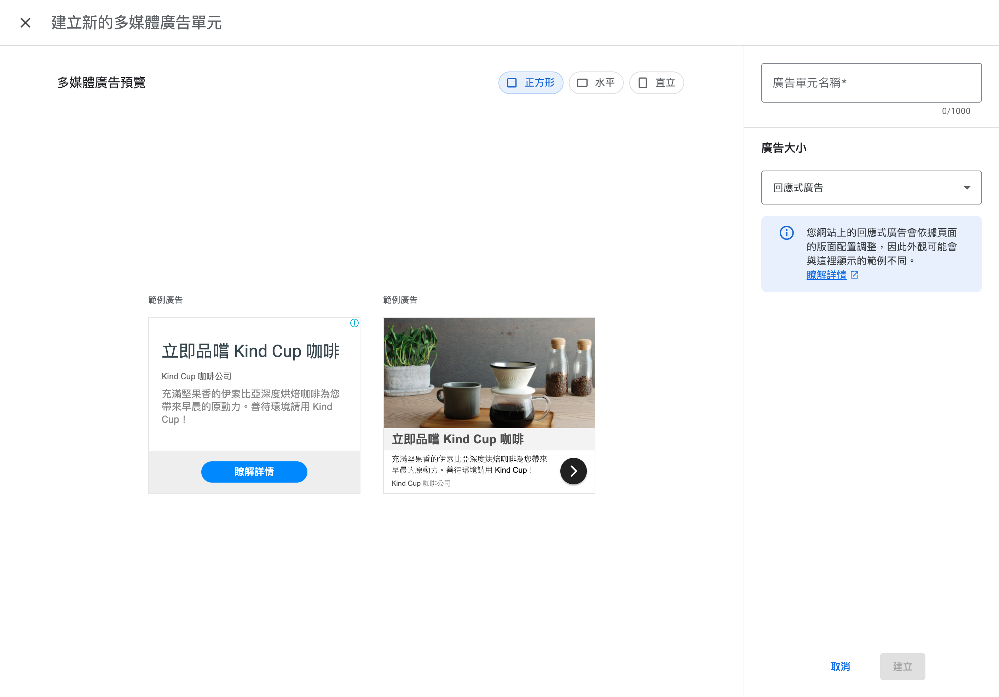
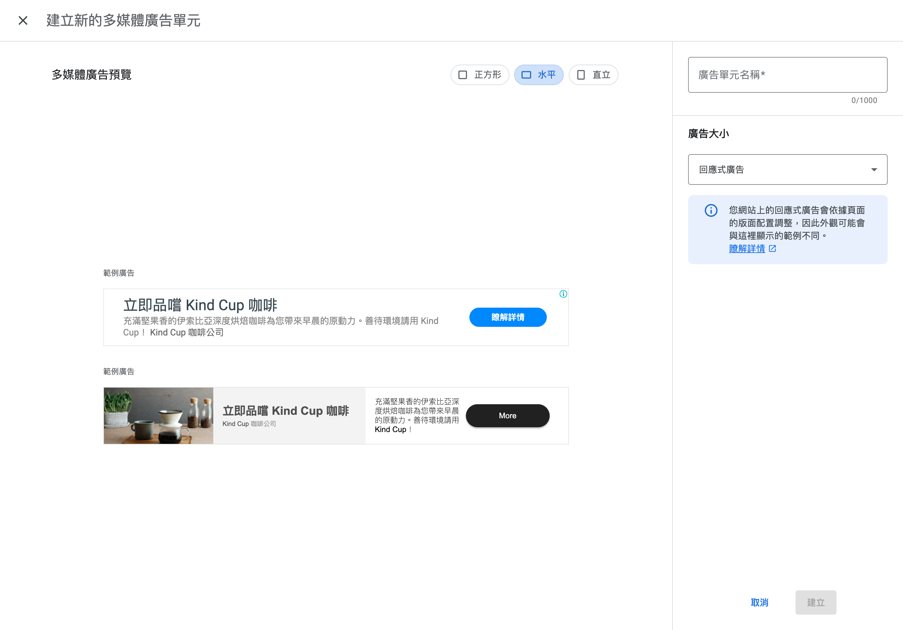
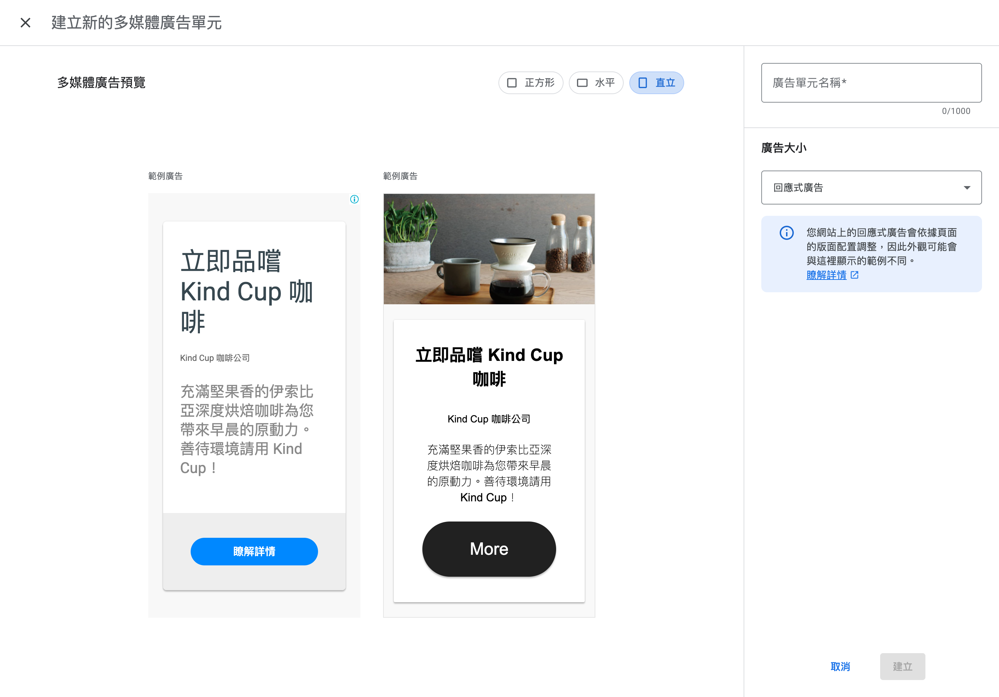
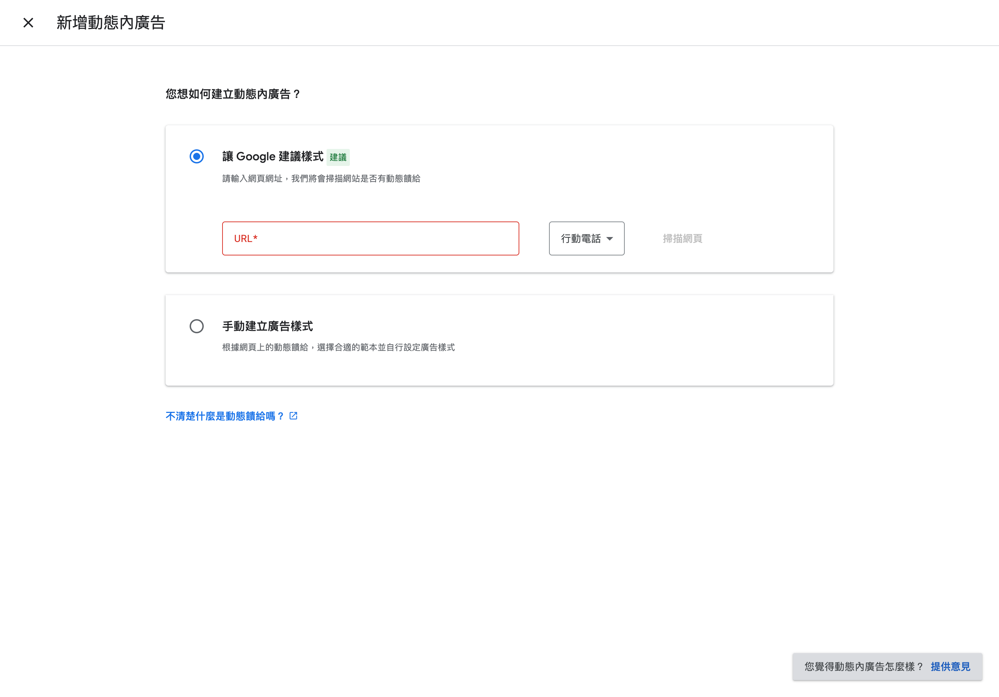
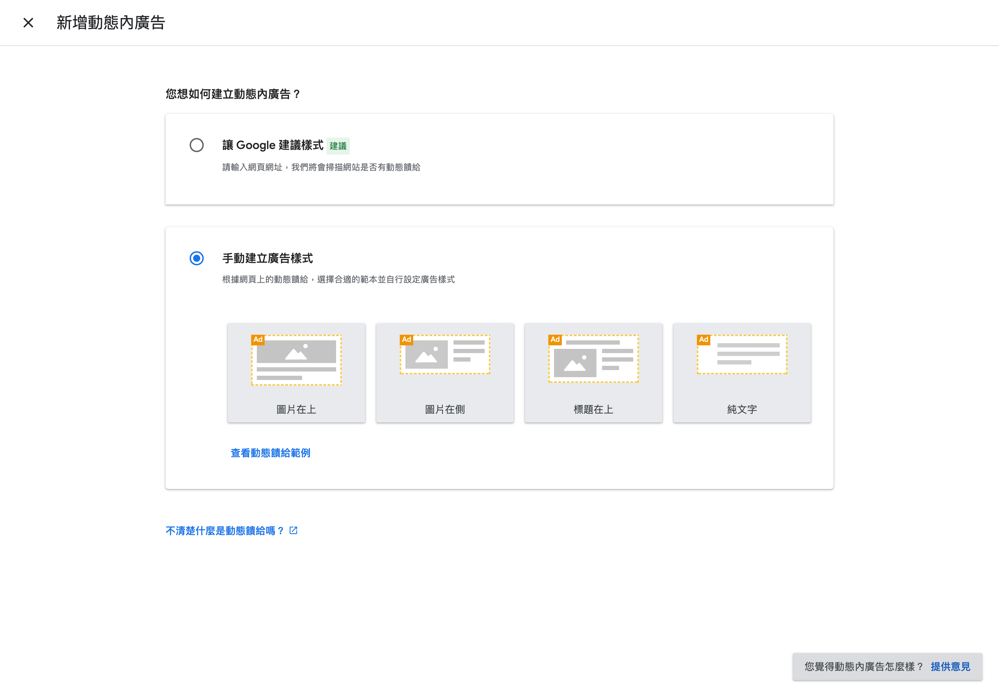
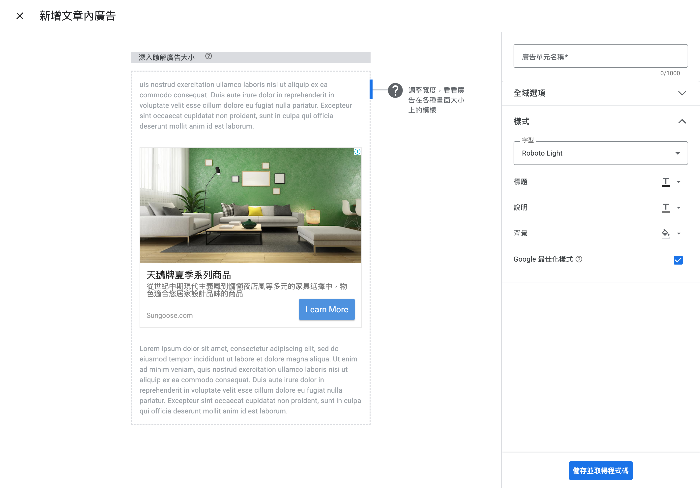
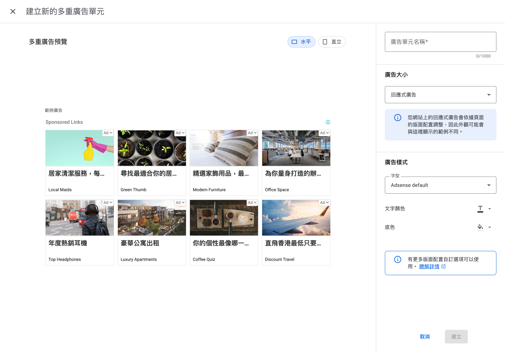
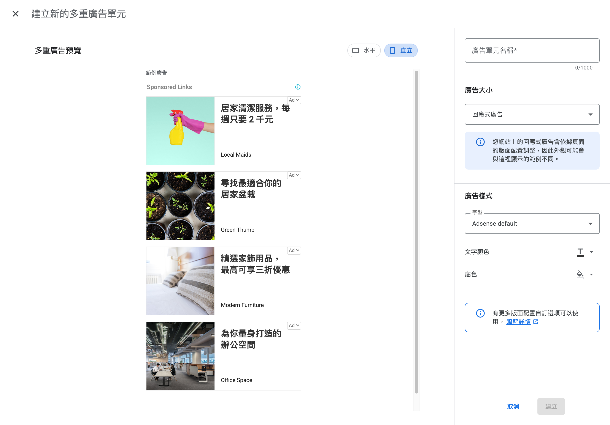

# Google AdSense 廣告類型比較

## 總覽

你的 AdSense 帳號提供 4 種廣告單元類型。以下是各類型的詳細比較。

---

## 1. 多媒體廣告（Display Ads）

**標籤**：建議採用 + AMP 支援

**說明**：面面俱到，適用於任何情境。

**特點**：
- Google 官方推薦的廣告類型
- 支援 3 種形狀：正方形、水平、直立
- 預設為「回應式廣告」，會依頁面版面自動調整大小
- 可包含圖片、標題、說明文字、CTA 按鈕
- 支援 AMP 頁面

**適用場景**：
- 側邊欄（Sidebar）
- 頁首/頁尾橫幅
- 文章段落之間
- 任何需要廣告的位置（萬用型）

**你現有的廣告單元**：
- `Anchor-Horizontal`（2079395003）— 水平錨定廣告
- `Display-Sidebar`（2270966699）— 側邊欄廣告

**預覽截圖**：

正方形：

水平：

直立：

---

## 2. 動態內廣告（In-feed Ads）

**標籤**：原生

**說明**：貼近您網站的外觀，適合放在貼文和產品資訊中。

**特點**：
- 原生廣告格式，會模擬網站的內容卡片樣式
- 可讓 Google 自動掃描網頁建議樣式，或手動選擇範本
- 4 種範本：圖片在上、圖片在側、標題在上、純文字
- 廣告會融入內容列表中，用戶仍知道是廣告但視覺上自然

**適用場景**：
- 卡片列表中間（如怪物列表、物品列表）
- 搜尋結果列表
- 產品目錄
- 任何有重複性卡片/列表的頁面

**你現有的廣告單元**：
- `Infeed-CardList`（4186683592）— 卡片列表內廣告

**預覽截圖**：

設定頁面（Google 自動建議 + 手動範本）：

手動範本選擇（圖片在上/在側/標題在上/純文字）：

---

## 3. 文章內廣告（In-article Ads）

**標籤**：原生

**說明**：同樣貼合您網站的外觀，適合搭配文章和內容網頁使用。

**特點**：
- 專為文章/長篇內容設計的原生廣告
- 插入在段落與段落之間，不打斷閱讀體驗
- 可自訂字型、標題顏色、說明顏色、背景色
- 支援「Google 最佳化樣式」自動調整外觀
- 廣告寬度可調整以適應不同螢幕

**適用場景**：
- 長篇文章頁面
- 攻略/指南頁面
- 部落格文章
- 任何段落式的文字內容頁面

**你現有的廣告單元**：無

**預覽截圖**：

---

## 4. Multiplex 廣告

**標籤**：原生 + AMP 支援

**說明**：用來顯示內容建議式原生廣告的格狀廣告單元。

**特點**：
- 格狀版面，一次顯示多則廣告（4x2 = 8 則為預設）
- 外觀類似「推薦內容」或「相關文章」區塊
- 支援水平和直立兩種排列
- 可自訂字型、文字顏色、底色
- 支援 AMP 頁面
- 每則廣告包含縮圖 + 標題 + 廣告來源

**適用場景**：
- 頁面底部（文章結尾、搜尋結果底部）
- 側邊欄大區塊
- 首頁推薦區塊
- 取代「相關推薦」區域

**你現有的廣告單元**：
- `Multiplex-HomePage`（6200271711）— 首頁 Multiplex 廣告

**預覽截圖**：

水平（4x2 格狀）：

直立（列表式）：

---

## 比較總表

| 特性 | 多媒體廣告 | 動態內廣告 | 文章內廣告 | Multiplex |
|------|:---:|:---:|:---:|:---:|
| **Google 推薦** | 建議採用 | - | - | - |
| **原生風格** | - | 原生 | 原生 | 原生 |
| **AMP 支援** | 支援 | - | - | 支援 |
| **形狀選項** | 正方形/水平/直立 | 4 種範本 | 固定（段落間） | 水平/直立 |
| **自訂樣式** | 有限 | 高度自訂 | 字型+顏色 | 字型+顏色 |
| **廣告數量/單元** | 1 則 | 1 則 | 1 則 | 多則（4-8） |
| **回應式** | 支援 | 支援 | 支援 | 支援 |
| **最適合** | 任何位置 | 列表/卡片間 | 文章段落間 | 頁面底部 |

---

## 你目前的廣告配置

| 廣告單元名稱 | 類型 | 建立日期 |
|-------------|------|---------|
| Multiplex-HomePage | Multiplex | 2025/12/19 |
| Anchor-Horizontal | 多媒體廣告 | 2025/12/18 |
| Infeed-CardList | 動態內廣告 | 2025/12/18 |
| Display-Sidebar | 多媒體廣告 | 2025/12/18 |

---

## 針對 ChronoStory Search 的建議

以下根據你的網站特性提供參考：

### 網站特點
- 主要是搜尋/查詢工具型網站（怪物、物品資料庫）
- 有大量列表式內容（搜尋結果、怪物列表、物品列表）
- 沒有長篇文章/部落格內容
- 有 Modal 彈窗顯示詳細資訊

### 各廣告類型適合度

| 廣告類型 | 適合度 | 理由 |
|---------|:---:|------|
| **多媒體廣告** | 高 | 萬用型，適合側邊欄和頁面空白處 |
| **動態內廣告** | 高 | 搜尋結果列表中穿插廣告很自然 |
| **文章內廣告** | 低 | 網站沒有長篇文章內容 |
| **Multiplex** | 中 | 適合放在搜尋結果頁底部 |
